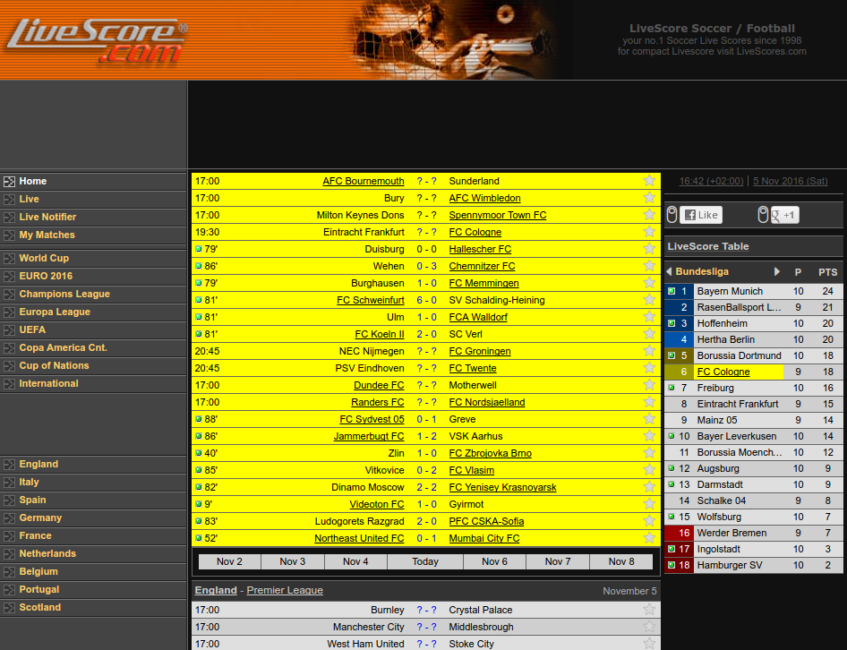
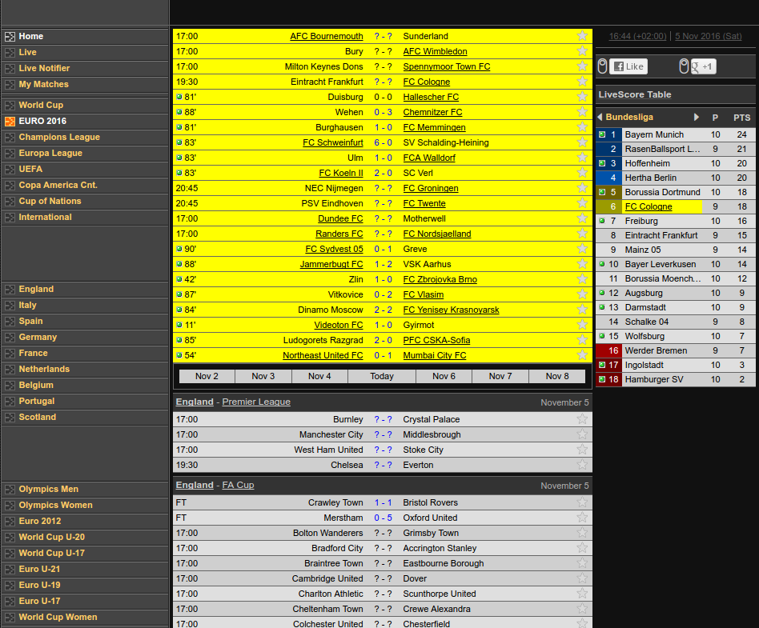
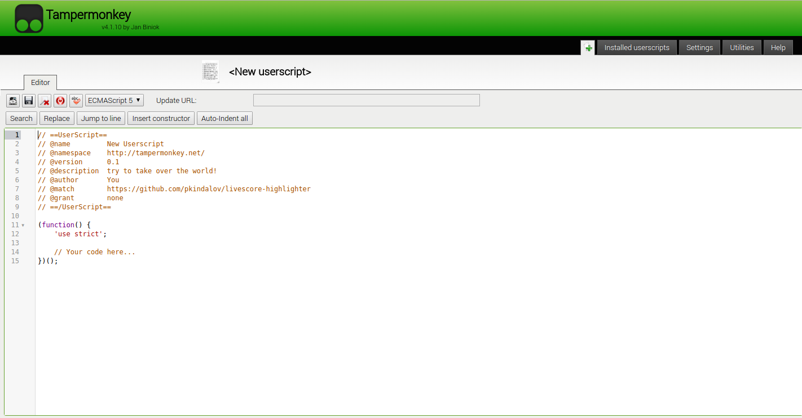

# livescore-highlighter
Search and if find team highlight background with yellow and underline team name

In pictures below the results which contains teams with FC in their names.

<u><strong>Important.</strong> When refresh browser the site will return on it original states. For better effect you must use <em>Tampermonkey</em> extension for Chrome and load this function on it.</u>

To use script <strong><em>first</em></strong> you must change searching team name or just enter some word in Livescore Highlighter.js The variable you must change is <strong><em>team1 = "your text here"</em></strong>

<strong><em>Secondly</em></strong> you must open livescore on tab in your browser. Then you must run console (f12 in Chrome) and then paste code from Livescore-Highlighter.js and wait 30 seconds to load. You can change load time from 30 seconds to what you want in this piece of code.
<code>
	window.setInterval(function() {
                  findMyTeam();
                }, 30000); 
</code>

<strong>How to put this code in Google Chrome ?</strong>
Firsty, you must install Chrome plugin called <strong><em>Tampermonkey</em></strong> If you have installed it properly then icon must appeart top right near to address bar. Show it in next screenshot.

Secondly... Now when you have installed Tampermonkey plugin to your Chrome browser, now must open Tampermonkey dashboard. 

Next step is to click on a little green plus sign, left on installed userscripts tab.

Now you must see this window...

Next step is to copy/paste all code from Livescore Highlighter.js in this window like it is showing on the next screenshot.

